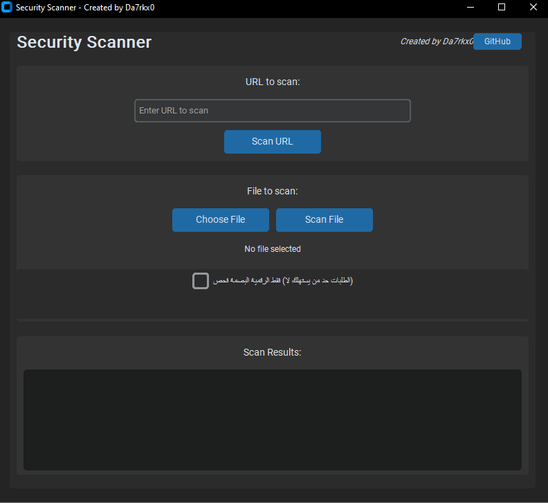

# Security Scanner 

This Python application provides an interface to scan files and URLs using the VirusTotal API for security threats and malware.

## Features

- Scan local files for malware and threats
- Scan URLs for security issues
- Retrieve detailed scan reports
- Interactive command-line interface

## Setup

1. Install the required dependencies:
```bash
pip install -r requirements.txt
```

2. Create a `.env` file by copying the `.env.example` file:
```bash
cp .env.example .env
```

3. Sign up at https://www.virustotal.com/ and get your API key

4. Edit the `.env` file and add your VirusTotal API key:
```
VIRUSTOTAL_API_KEY=your_api_key_here
```

## Usage

Run the scanner:
```bash
python scanner.py
```

Follow the interactive menu to:
1. Scan files
2. Scan URLs
3. Get scan reports
4. Exit the program

## Note

Make sure you have a valid VirusTotal API key and sufficient API credits for scanning files and URLs.

<div dir="rtl">

# Security Scanner 🛡️

برنامج فحص أمني باستخدام واجهة برمجة VirusTotal API مع واجهة مستخدم رسومية سهلة الاستخدام.



## 🌟 المميزات

- ✨ واجهة مستخدم عربية سهلة الاستخدام
- 🔍 فحص الملفات باستخدام أكثر من 70 محرك مكافحة فيروسات
- 🌐 فحص الروابط للتأكد من سلامتها
- 📊 عرض نتائج تفصيلية للفحص
- 🔄 دعم فحص البصمة الرقمية للملفات (لا يستهلك من حد الطلبات)
- 🌙 وضع مظلم أنيق
- 💻 متوافق مع نظام Windows

## 📋 المتطلبات

- مفتاح API من [VirusTotal](https://www.virustotal.com) (مجاني)
- نظام Windows
- اتصال إنترنت

## ⚙️ التثبيت

### تشغيل النسخة التنفيذية (exe)

1. قم بتحميل أحدث إصدار من [صفحة الإصدارات](https://github.com/Da7rkx0/SecurityScanner/releases)
2. قم بفك ضغط الملف
3. قم بإنشاء ملف `.env` في نفس مجلد البرنامج وأضف مفتاح API الخاص بك:
   ```
   VIRUSTOTAL_API_KEY=your_api_key_here
   ```
4. قم بتشغيل `Security Scanner.exe`

### تشغيل من الكود المصدري

1. قم بنسخ المستودع:
   ```bash
   git clone https://github.com/Da7rkx0/SecurityScanner.git
   cd SecurityScanner
   ```

2. قم بتثبيت المتطلبات:
   ```bash
   pip install -r requirements.txt
   ```

3. قم بإنشاء ملف `.env` وأضف مفتاح API الخاص بك:
   ```
   VIRUSTOTAL_API_KEY=your_api_key_here
   ```

4. قم بتشغيل البرنامج:
   ```bash
   python scanner_gui.py
   ```

## 🔑 الحصول على مفتاح API

1. قم بإنشاء حساب في [VirusTotal](https://www.virustotal.com)
2. قم بتسجيل الدخول
3. اذهب إلى [صفحة API](https://www.virustotal.com/gui/user/[your_username]/apikey)
4. انسخ مفتاح API وأضفه إلى ملف `.env`

## 📝 كيفية الاستخدام

### فحص ملف
1. انقر على "اختيار ملف"
2. حدد الملف المراد فحصه
3. انقر على "فحص الملف"
4. انتظر حتى تظهر النتائج

### فحص رابط
1. أدخل الرابط في حقل النص
2. انقر على "فحص الرابط"
3. انتظر حتى تظهر النتائج

### فحص البصمة الرقمية فقط (عند نفاد حد الطلبات)
1. قم بتفعيل خيار "فحص البصمة الرقمية فقط"
2. اختر الملف وابدأ الفحص
3. انسخ البصمة الرقمية
4. اذهب إلى [موقع VirusTotal](https://www.virustotal.com/gui/home/search)
5. الصق البصمة الرقمية وابحث عنها

## ⚠️ ملاحظات هامة

- حجم الملف الأقصى: 32 ميجابايت
- عدد الطلبات المسموحة للحسابات المجانية:
  - 500 طلب في اليوم
  - 4 طلبات في الدقيقة
- لا تقم بمشاركة مفتاح API الخاص بك مع أي شخص
- البرنامج يدعم فحص الملفات التالية:
  - ملفات تنفيذية (exe, dll, sys, ...)
  - مستندات (pdf, doc, docx, ...)
  - ملفات مضغوطة (zip, rar, 7z, ...)
  - وأكثر

## 🤝 المساهمة

نرحب بمساهماتكم! يرجى:
1. عمل Fork للمشروع
2. إنشاء فرع جديد (`git checkout -b feature/amazing-feature`)
3. عمل Commit للتغييرات (`git commit -m 'Add amazing feature'`)
4. رفع التغييرات (`git push origin feature/amazing-feature`)
5. فتح Pull Request

## 📄 الترخيص

هذا المشروع مرخص تحت [MIT License](LICENSE)

## 👤 المطور

- GitHub: [@Da7rkx0](https://github.com/Da7rkx0)

## 📧 الدعم

إذا واجهت أي مشكلة أو لديك اقتراح، يرجى:
1. فتح [Issue جديد](https://github.com/Da7rkx0/SecurityScanner/issues)
2. أو التواصل معي مباشرة عبر GitHub

</div>
